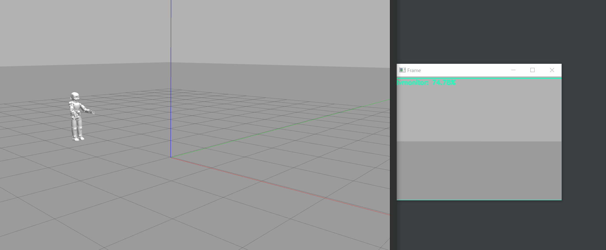

# iCub Gazebo Setup

 

The purpose of this repository is to guide you through the installation of YARP and Gazebo in such a way that importing an iCub model inside the simulation it will automatically connect to the yarp server. We will also cover the installation of the yarp python bindings and provide a simple python image recognition script with OpenCV.

## Install the Superbuild
The superbuild is comprised by different software developed by the [robotology GitHub organization](https://github.com/robotology/), such as the YARP middleware and the iCub gazebo models. To downoload the supurbuild on windows you just need to access the [release page](https://github.com/robotology/robotology-superbuild/releases) and downolad and execute the full installer.
This will also install the Gazebo simulation environment and set up the PATH system variable.

## Compile the Python Bindings
To interact with the icub model through YARP using python you will need to compile the python bindings using the Swig interface compiler.

First you will need to install the last version of swigwin in your home directory:
1 - Downolad the latest version of swig from http://www.swig.org/download.html
2 - Extract the content in your home directory
3 - Inclued the swigwin directory in the windows PATH system variable
